# Parv Arora

### Data • Analytics • Product • Systems

 

<h3><code>Parv-spamz@github ~ $ ./contributions.sh</code></h3>

<table align="center" width="860" style="border-collapse: collapse; border: none; margin: 12px auto 0 auto;">
  <tr align="center">
    <td align="center" width="45%" style="border: none; padding: 4px;">
      
    </td>
    <td align="center" width="55%" style="border: none; padding: 4px;">
      
    </td>
  </tr>
</table>

---

## Technical Competencies

  <b>LANGUAGES</b> 
  

  <b>CORE SYSTEMS &amp; DATABASES</b> 
  

  <b>TOOLING &amp; FRAMEWORKS</b> 
  

---

## Featured Systems

### GradeNest
`[Internal Architecture]` • Academic Operations & Performance Intelligence

An enterprise academic framework engineered to unify administration, credentialing, and performance intelligence across multi-institution environments.

- **Administrative Lifecycles:** Centralizes student records, grading workflows, and automated generation of tamper-evident marksheets and institutional credentials.
- **Academic Intelligence:** Ingestion pipelines aggregate historical academic data into structured performance metrics and diagnostic cohorts for leadership oversight.
- **Computation DAG Engine:** Implements directed acyclic graph (DAG) evaluation engines for prerequisite validation, GPA/CGPA computation, and automated graduation audits.
- **Verification & Resilience:** Comprehensive automated test harnesses validating edge grading models, concurrency constraints, and high-load batch processing.

---

### Doctor Appointment Scheduling System
`[Public Production System]` • Healthcare Operations & Queue Optimization

A full-stack clinical appointment coordination platform engineered to mitigate wait cascades and eliminate schedule drift in high-volume practices.

- **Dynamic Slot Recalculation:** Adjusts downstream appointment schedules in real-time based on actual procedural durations, mitigating operational bottlenecks.
- **Dual Role-Based Portals:** Purpose-built interfaces separating practitioner clinical schedule management from frictionless patient booking.
- **Buffer Architecture:** Configurable procedure-specific buffer windows designed to absorb patient turnaround delays without disrupting doctor throughput.
- **Event-Driven Communication:** Integrated Twilio SMS notification pipeline for appointment confirmations, live delay notifications, and rescheduling triggers.
- **Stack & Architecture:** Python (Flask), React (TypeScript & Vite), SQLite, Tailwind CSS, Twilio API.

[View Source Repository](https://github.com/Parv-spamz/Parv_Arora_Anshika_Trikha_Doctor_Appointment_Scheduling_System)

---

<h3><code>Parv-spamz@github ~ $ ./connect.sh --channel=all</code></h3>

<table align="center" width="860">
  <tr align="center">
    <td align="center" width="50%">
      
    </td>
    <td align="center" width="50%">
      
    </td>
  </tr>
  <tr align="center">
    <td align="center" width="50%">
      
    </td>
    <td align="center" width="50%">
      
    </td>
  </tr>
</table>

